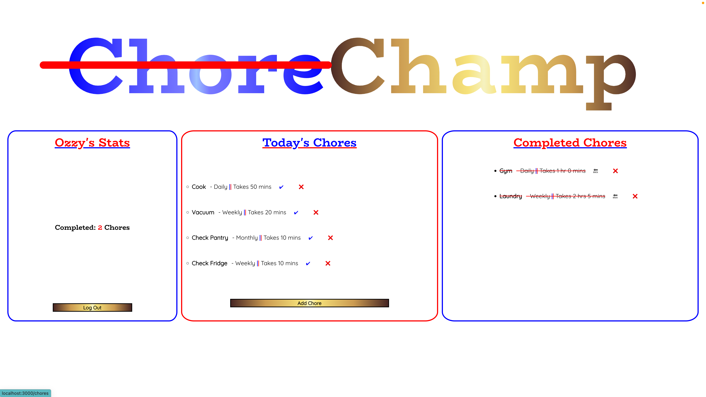
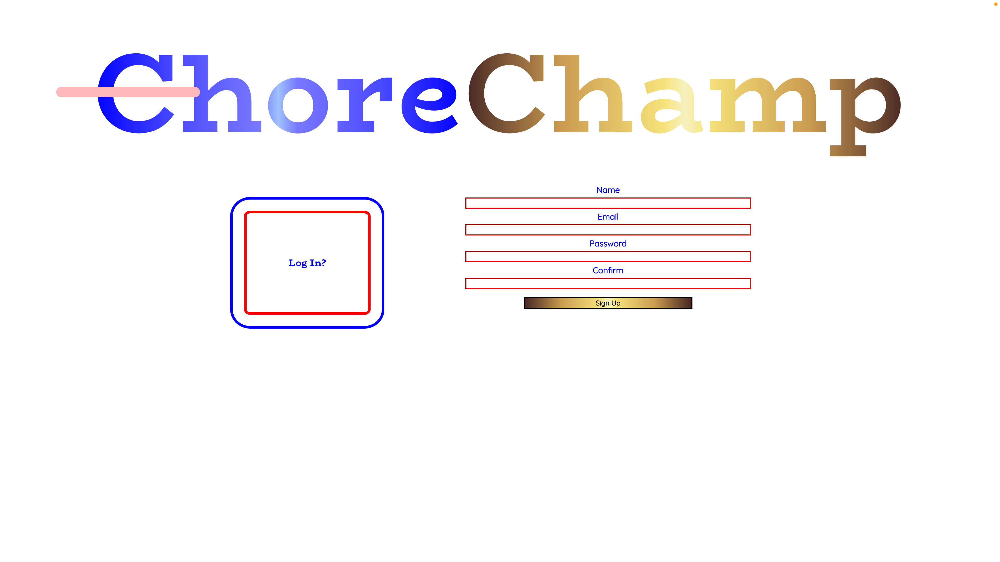
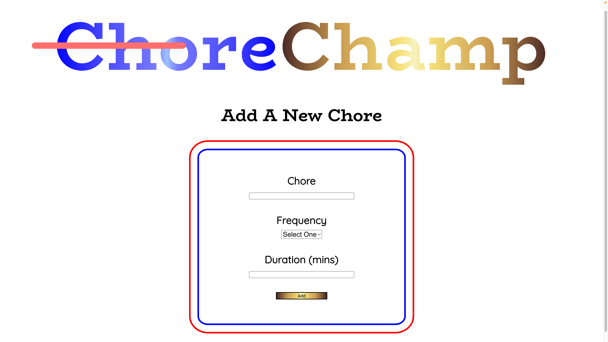

# **ChoreChamp**  

## General Overview  
Let's get cleaning! Yikes, that doesn't sound fun (well, to most people at least). With ChoreChamp, become the Champion of your home! You can add chores that need to be done for the day and even get them reoccuring daily, weekly, or monthly. You will be able to see your stats on the left, Today's chores in the middle, and all completed chores on the right. Just login, keep track, and get cleaning!

## Getting Started
The site can be accessed [here]().

## Screenshots  
Landing Page:  

Sign Up Page:  

Add Chore Page:  

Planning (Trello, ERD, Wireframe):

## Technologies Used  
- HTML
- CSS
- JavaScript
- Mongoose
- MongoDB
- Express
- React
- Node
- Heroku
- node-schedule

## Future Work  
- **Add Multiple Users**  
What better way to get your chores done but by making it a competition? Declare the true ChoreChamp by keeping track of who does what chores and who is doing the most. The champ will be determined at the end of the set period (week or month) and a pre-determined prize can be awarded (maybe getting treated on a night out or no complaints for a day?). 
- **Goal Model**  
A goal model will be nice to implement as an aid to determining the ChoreChamp. Could be X chores needing to be done in a week and whoever does the most wins or could be the first to Y number of chores is the winner. The goal could also be implemented for a solo user to determine a nice treat after a busy week or month too!
- **Email/Text Reminder Notifications**
In case this app isn't ingrained into your daily routine, a reminder would be handy! It would probably show the chores for that day at the start of your day.